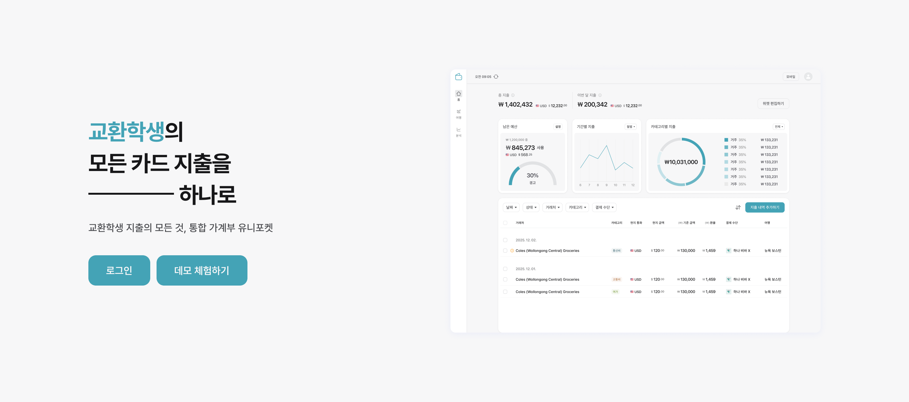
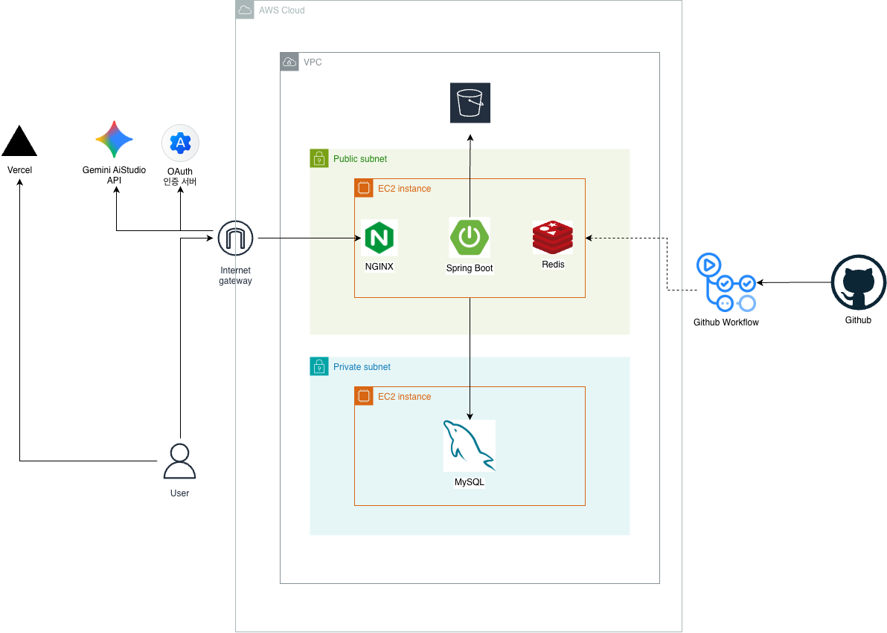

# 💳 UniPocket (유니포켓)

> **교환학생 지출 관리의 모든 과정을 스마트하게**

<p align="center">
  
</p>

<p align="center">
  🔗 <strong><a href="https://www.unipocket.co.kr/" target="_blank">
  UniPocket 서비스 바로가기
  </a></strong>
</p>

---

## 📚 목차

- 🚀 [서비스 소개](#-서비스-소개)
- 💡 [주요 기능](#-주요-기능)
- 🔧 [Tech Stack](#-tech-stack)
- 🧑🏻‍💻 [팀원 소개](#-팀원-소개)
- 📝 [협업 기록 & 데일리 프로세스](#-협업-기록--데일리-프로세스)
- 🔗 [Github & 서비스 링크](#-github--서비스-링크)
- 🏗 [프로젝트 아키텍처](#-프로젝트-아키텍처)

---

## 🚀 서비스 소개

### 📌 한 줄 소개

국내 카드부터 해외 카드까지 한 번에 관리하는 **교환학생 맞춤형 통합 가계부 서비스**

### 🎯 타겟 사용자

- 한국 카드 + 해외 카드 + 현금을 함께 사용하는 교환학생
- 여러 통화를 동시에 관리해야 하는 사용자
- 환율 변동을 고려한 소비 관리가 필요한 사용자

---

## 💡 주요 기능

### 1️⃣ 지출 기록 및 자동화

- **다양한 입력 방식 지원**
  - 영수증 OCR 인식
  - 은행 앱 스크린샷 분석
  - 거래 내역 파일(CSV / Excel) 업로드
  - 직접 입력 기능 제공

- **지출 내역 자동 분류**
  - 날짜 / 거래처 / 카테고리 / 결제 수단 자동 추출
  - 데이터 기반 자동 분류 처리

### 2️⃣ 다차원 필터링 및 조회

- 기간(날짜)
- 거래처
- 카테고리
- 결제 수단

다양한 조건으로 빠르게 필터링하여 조회 가능

### 3️⃣ 개인화 지출 대시보드 (위젯)

- 카테고리별 지출 현황
- 결제 수단별 사용 비율
- 월별 소비 추이
- 비교 그래프 제공

→ 메인 화면에서 한눈에 소비 흐름 확인 가능

### 4️⃣ 여행/목적별 지출 관리

- 여행 기간 지출을 별도 세션으로 관리
- 일상 지출과 완전히 분리
- 여행 단위 소비 분석 가능

### 5️⃣ 동일 국가 교환학생 소비 비교

- 동일 국가/지역 평균 지출과 비교
- 내 소비 수준 객관적 점검 가능
- 소비 패턴 분석 기반 인사이트 제공

---

## 🔧 Tech Stack

### 💻 Frontend

> 서비스의 사용자 인터페이스(UI)와 상호작용 로직 담당

 

 

 

 

<details>
<summary>📂 Frontend 디렉토리 구조</summary>

```
frontend/
├── src/
│   ├── api/              # API 모듈 (account-books, auth, cards, expenses 등)
│   ├── assets/           # 이미지/아이콘/정적 리소스
│   ├── components/       # 공통 및 도메인 UI 컴포넌트
│   ├── constants/        # 상수 정의
│   ├── data/             # 프론트 샘플/정적 데이터
│   ├── hooks/            # 커스텀 훅
│   ├── lib/              # 유틸리티
│   ├── pages/            # 페이지 컴포넌트
│   ├── routes/           # TanStack Router 라우트 정의
│   ├── stores/           # 전역 상태(zustand)
│   ├── styles/           # 전역 스타일
│   ├── test/             # 프론트 단위 테스트
│   └── types/            # 타입 정의
├── index.html
├── package.json
├── pnpm-lock.yaml
└── vite.config.ts
```

</details>

<br/>

### Backend

> 서비스의 비즈니스 로직, 데이터베이스, API 관리

  

  

<details>
<summary>📂 Backend 디렉토리 구조</summary>

```
backend/
├── src/
│   ├── main/
│   │   ├── java/com/genesis/unipocket/
│   │   │   ├── accountbook/
│   │   │   ├── analysis/
│   │   │   ├── auth/
│   │   │   ├── exchange/
│   │   │   ├── expense/
│   │   │   ├── media/
│   │   │   ├── tempexpense/
│   │   │   ├── travel/
│   │   │   ├── user/
│   │   │   ├── widget/
│   │   │   └── UnipocketApplication.java
│   │   └── resources/
│   │       ├── application.yml
│   │       ├── application-dev.yml
│   │       ├── application-test-unit.yml
│   │       └── application-test-it.yml
│   └── test/
│       └── java/com/genesis/unipocket/
├── docs/
├── build.gradle
├── settings.gradle
├── gradlew
└── gradlew.bat
```

</details>

<br/>

### Deploy

> CI/CD 자동화 및 클라우드 환경에서의 서비스 배포 관리

 

---

## 🧑🏻‍💻 팀원 소개

<table>
  <thead>
    <tr>
      <th align="center" colspan="3">💻 Frontend</th>
      <th align="center" colspan="2">🛠️ Backend</th>
    </tr>
  </thead>
  <tbody>
    <tr>
<td align="center" width="200">
    <a href="https://github.com/1jiwoo27">
    
    <br />
    <sub><b>엄지우</b></sub>
    </a>
</td>
<td align="center" width="200">
    <a href="https://github.com/Kjiw0n">
    
    <br />
    <sub><b>김지원</b></sub>
    </a>
</td>
<td align="center" width="200">
    <a href="https://github.com/minngyuseong">
    
    <br />
    <sub><b>성민규</b></sub>
    </a>
</td>
<td align="center" width="200">
    <a href="https://github.com/AnarchyDeve">
        
        <br />
        <sub><b>김동균</b></sub>
    </a>
</td>
<td align="center" width="200">
    <a href="https://github.com/kcw2205">
        
        <br />
        <sub><b>김찬우</b></sub>
    </a>
</td>
</tr>
  </tbody>
</table>

---

## 📝 협업 기록 & 데일리 프로세스

UniPocket 팀은 프로젝트 기간 동안  
**매일 기록하고, 매일 공유하는 개발 프로세스**를 운영했습니다.

### 📅 데일리 스크럼

- 매일 **오전 10시** 진행
- 공유 내용
  - 어제 한 일
  - 오늘 할 일
- 돌아가면서 각자의 진행 상황을 공유하고 논의하는 시간을 가졌습니다.

🔗 **[데일리 스크럼 기록 바로가기](https://www.notion.so/bside/2ee22020273580d69a76dde3b9b5b337)**

### 🔁 데일리 회고

- 매일 **오후 6시** 진행
- 공유 내용
  - 오늘 느낀 점
  - 개선할 점
  - 팀/프로세스 관련 인사이트
- 돌아가면서 발표하며 팀 전체의 방향성을 점검했습니다.

🔗 **[회고 기록 바로가기](https://www.notion.so/bside/2ed22020273580cf8291e0b677324930)**

---

## 🔗 Github & 서비스 링크

프로젝트 관련 자료와 문서를 아래에서 확인하실 수 있습니다.

### 📘 Wiki

프로젝트 진행 과정과 기술 문서를 정리한 공간입니다.

🔗 **[Wiki 바로가기](https://github.com/softeerbootcamp-7th/WEB-Team1-Unipocket/wiki)**

### 🎨 디자인 (Figma)

최종 디자인 시안 및 핸드오프 문서를 확인할 수 있습니다.

🔗 **[디자인 바로가기](https://www.figma.com/design/fC3n8H8ialRaNYWbI1coXA/-1%E1%84%90%E1%85%B5%E1%86%B7--Final-Design---Handoff?m=dev)**

### 📊 서비스 기획안

서비스 기획 배경과 기능 정의를 정리한 자료입니다.

🔗 **[서비스 기획안 바로가기](https://www.figma.com/slides/CzLAOcxVJT5eNuchdMZbgB/%EC%A0%9C%EB%84%A4%EC%8B%9C%EC%8A%A4-%EC%84%9C%EB%B9%84%EC%8A%A4-%EA%B8%B0%ED%9A%8D%EC%95%88?t=edg8re9TN70qPRtK-0)**

---

## 🏗 프로젝트 아키텍처

<p align="center">
  
</p>
